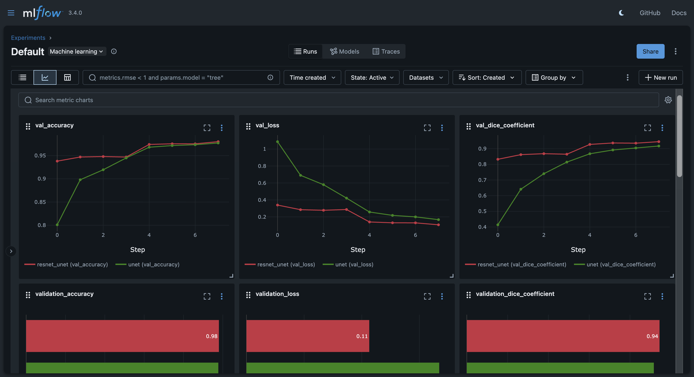

# COVID-19 Lung Segmentation with U-Net and MobileNet-U-Net

## Overview

This project focuses on **segmenting lungs from COVID-19 X-ray images** using deep learning. It started as a lab exercise in my **4th-year Deep Learning course** at the Higher School of Computer Science, where the goal was to implement U-Net.  

I **extended the lab work** significantly by:  

- **Implementing MobileNet-U-Net** to leverage a pre-trained backbone for better segmentation performance.  
- **Integrating MLflow** to track experiments, compare models, and manage model artifacts efficiently.  
- **Structuring the project** into a modular Python package with scripts for dataset handling, training, deployment, and inference, rather than working solely in a notebook.

Through this extension, I observed that the **MobileNet-U-Net consistently outperformed the standard U-Net**, demonstrating the benefit of using a pre-trained backbone.

---

# Mlflow Dashboard


## Project Structure

```
image_segmentation/                 
src/
    ├── fetch_data.py       # Download and preprocess dataset from Kaggle
    ├── train.py            # Train U-Net and MobileNet-U-Net models
    ├── deploy.py           # Run inference
    ├── utils.py            # Helper functions for preprocessing, image handling, inference, etc.
    ├── dataset.py          # Dataset utilities
    ├── model.py            # Model definitions (U-Net and MobileNet-U-Net)
    └── eval.py             # Evaluation metrics and helper functions
data/
    ├── preprocessed/              # Training images
    ├── raw/                # Raw downloaded images
    └── predict/            # New images for inference
inference/              # Model predictions output
mlruns/0               # MLflow experiment tracking
kaggle.json            # Kaggle dataset credentials
notebook.ipynb         # Jupyter notebook 
requirements.txt       # Dependencies
```

---

## Key Features

- **U-Net and MobileNet-U-Net** for COVID-19 lung segmentation.  
- **Fine-tuned MobileNet backbone** for improved segmentation performance.  
- **MLflow integration** for logging metrics, model artifacts, and easy comparison.  
- **Automated inference script** that selects the latest trained model.  
- **Structured project** organization, making it maintainable and extensible beyond a lab notebook.  

---

## Installation

```bash
# Clone the repository
git clone https://github.com/diaazg/image_segmentation.git
cd image_segmentation

# Create and activate a Conda environment
conda create -n ia python=3.11
conda activate ia

# Install dependencies
pip install -r requirements.txt
```

## Usage

1.	**Download the dataset (if not already present):**
```bash
python src/fetch_data.py
```

2.	**Train models (optional, you can skip if you already have trained models):**
```bash
python src/train.py
```

3.	**Run inference on new images:**
```bash
python src/fetch_data.py
```

- Predictions will be saved in the inference/ directory.

- Make sure to set the model path in Config class in `utils.py`.

## Tracking and Comparing Models with MLflow
MLflow is used to log experiments, track metrics, and compare models easily. Here’s how to utilize it:

1.	**Start the MLflow UI:**
```bash
mlflow ui
```

2. Open your browser and navigate to http://localhost:5000.

## Results

- The MobileNet-U-Net outperformed the baseline U-Net in segmentation accuracy and Dice coefficient.

- MLflow provides a clear comparison of both models, including metrics and saved model artifacts.


